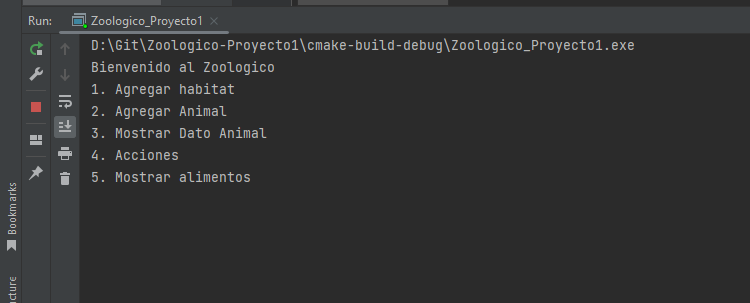
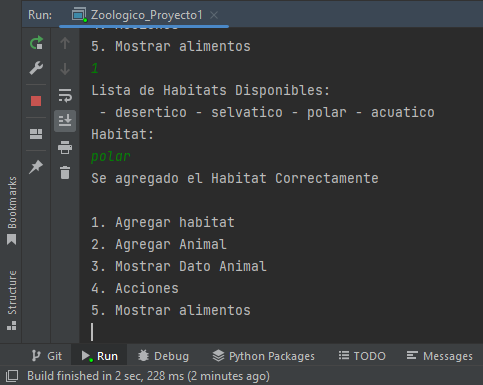
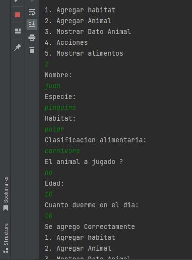
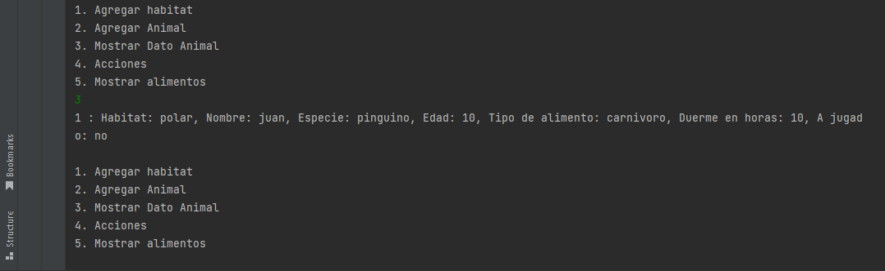
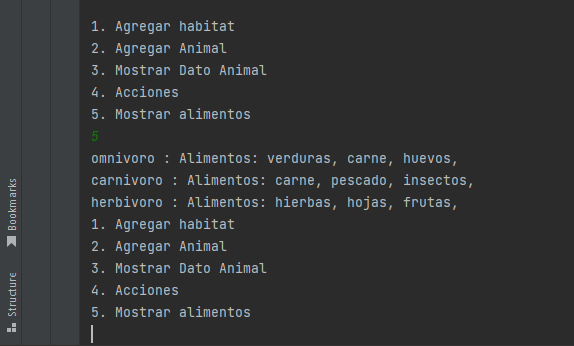
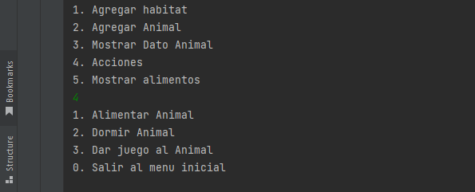
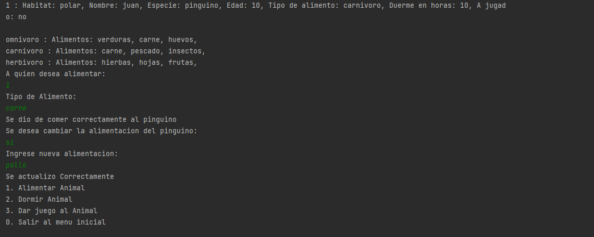
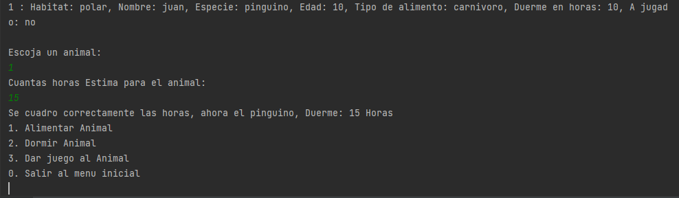
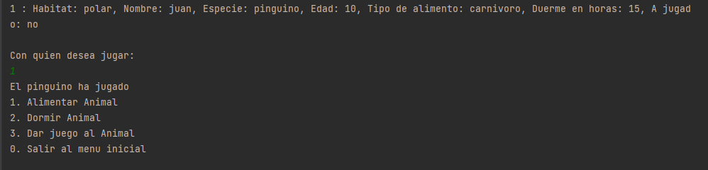
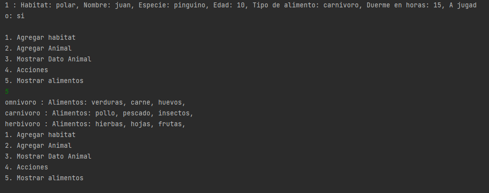

# Zoologico-Proyecto1
- Link Diagrama UML:
https://lucid.app/lucidchart/6b4d587c-e648-4590-abb7-ce0bca690384/edit?viewport_loc=165%2C140%2C1233%2C592%2C0_0&invitationId=inv_c879afee-95f2-4f33-9a00-7e0b41834b62

# Enunciado:
El programa en C++ debe simular el funcionamiento de un zoológico, y para ello debe hacer uso de los conceptos de programación orientada a objetos, como la creación de clases, relaciones (contenedores), herencia, sobrescritura, sobrecarga y modificadores de acceso.

- El zoológico se compone de diferentes hábitats, y cada hábitat puede contener varios animales. Cada animal tiene un nombre, una especie y un hábitat al que pertenece (entre otros). Se espera que el programa permita al usuario realizar las siguientes acciones:

- Añadir un nuevo hábitat al zoológico: el programa debe permitir al usuario agregar un nuevo hábitat al zoológico. Los tipos de hábitat definidos son desértico, selvático, polar y acuático.

- Añadir un nuevo animal a un hábitat existente: el programa debe permitir al usuario agregar un nuevo animal a un hábitat existente. Se debe validar que el hábitat exista y que permita contener el tipo de animal que se desea agregar. El animal debe permitir identificar a qué tipo de hábitat puede pertenecer (como un pingüino que pertenece al hábitat polar).

- Listar todos los hábitats del zoológico y sus respectivos animales: el programa debe permitir al usuario ver la información de los animales, como su nombre, edad, tipo de alimentación, estado de salud y cualquier otro atributo que el estudiante haya decidido agregar.

- Realizar una acción en particular para un animal específico: el programa debe permitir al usuario realizar una acción en particular para un animal específico, tomando como parámetros el identificador del animal y el nombre de la acción a realizar. Las acciones disponibles son comer, dormir y jugar. El programa debe validar si el animal ya ha jugado en el día, si el alimento está aprobado para su tipo de dieta y si el tiempo de sueño es suficiente para el animal.

- Permitir a los usuarios agregar y editar diferentes tipos de alimentos para los animales en el zoológico: el programa debe permitir al usuario agregar y editar diferentes tipos de alimentos para los animales en el zoológico. Los animales deben tener diferentes tipos de alimentación según su dieta: carnívoros, herbívoros y omnívoros.

El programa debe ser capaz de manejar errores de entrada y salida de datos, por ejemplo, si el usuario ingresa una edad no válida para un animal, el programa debe informar al usuario del error y solicitar que ingrese una edad válida.

# Funcionamiento:
- El codigo arranca con el menu inicial dando las siguientes opciones:
- 
- Entonces antes de hacer cualquier otra cosa hay que crear un habitat primero.
- 
- Luego hay que agregar un nuevo animal al zoologico.
- 
- Luego ya podriamos mostrar los datos disponibles de los animales.
- 
- Con la quinta opcion obtedriamos los datos alimentarios de cada clasificacion alimenticia.
- 
- Con la cuarta opcion, nos mostrara un menu alterno de lo que podemos realizar con los animales en el zoologico.
- 
- Alimentar animal, nos permitira darle de comer a un animal especifico con su respectivo alimento permitido
, como tambien la opcion de editar su alimento de esa clasificacion alimenticia.
- 
- Dormir animal, nos permitira reasignar el horario de sueño del animal entre un maximo y minimo permitido
- 
- Dar juego animal, nos permitira jugar con el animal cambiando su estado de no jugado a si jugado.
- 
- Este es el resultado final despues de los anteriores cambios.
- 